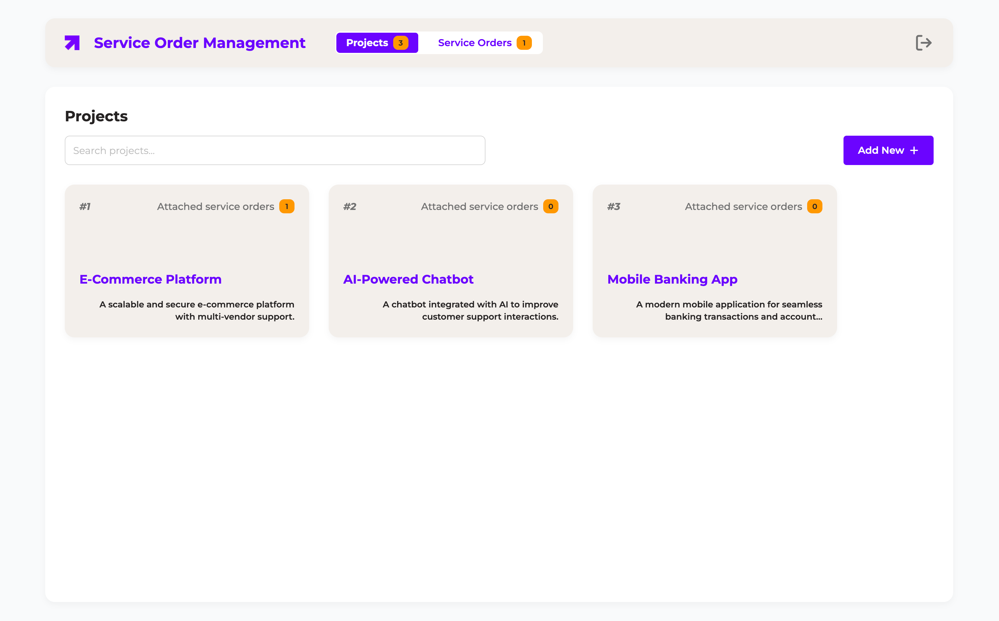

# NLC Full-Stack Developer



## Requirements

- Docker Compose version v2.32.4-desktop.1

## Running project

With docker compose installed, run the following command:

```bash
git clone https://github.com/diogoizele/nlc-full-stack-developer.git

cd nlc-full-stack-developer

docker compose build --no-cache && docker compose up -d
```

## Assets

- [Figma Prototype](https://www.figma.com/design/1csCHY5ggpNioSCJ6MTIPW/NoLimit-Creatives---Home-Test?node-id=0-1&t=M1Qba03YnAw30txk-1)
- [Features implemented in the project](./assets/docs/features.md)

## Using application

- Access `http://localhost:3000` to see the frontend application.

Use this credentials (pre-created) to login:

- **Email**: `admin@mail.com`
- **Password**: `admin`

## Ports

- Frontend running on `http://localhost:3000`
- Backend running on `http://localhost:8080`
- Database running on `http://localhost:3306`

## Choices

- [Runtime] Use [Bun](https://bun.sh/) as a TypeScript runtime, task runner and package manager.
- [Docker] I use [this repository](https://github.com/docker/awesome-compose/tree/master/react-express-mysql) to guide myself with docker compose.
- [Backend] Using Prisma ORM to manage database schema and queries.
- [Frontend] Create project using [vite CLI](https://vite.dev/guide/#scaffolding-your-first-vite-project) to init a React with TypeScript boilerplate initial code.
- [Frontend] Using [Serve](https://github.com/vercel/serve#readme) to expose frontend app.
- [Frontend] Using [Zustand](https://zustand.docs.pmnd.rs/getting-started/introduction) to manage global state.
- [Frontend] Using [React Router](https://reactrouter.com/7.2.0/home) to manage routes.
- [Frontend] Using [Axios](https://axios-http.com/docs/intro) to make HTTP requests.
- [Frontend] Using [React Query](https://tanstack.com/query/latest/docs/framework/react/quick-start) to manage cache and fetch data.
- [Frontend] Using [React Hook](https://www.react-hook-form.com/get-started/) Form to manage forms.
- [Frontend] Using [Date-fns](https://date-fns.org/docs/Getting-Started) to manage dates.
