# Features implemented in the project

## 1. Form validation

For this example, was created a default user with email `admin@mail.com` and password `admin`. The form validation was implemented using `react-hook-form`. The form validation is implemented in the login form.

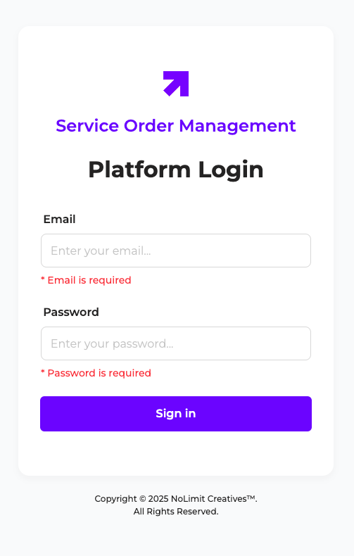
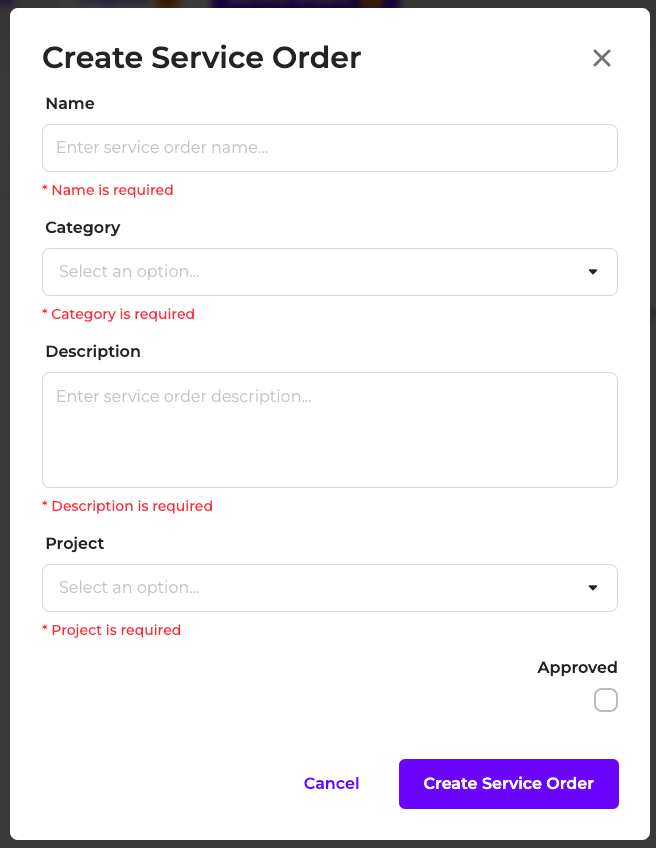

## 2. Toast for status messages

The toast was implemented using `react-hot-toast`. The toast is shown when the user tries to login with invalid credentials.

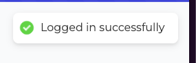

## 3. Empty list indicator

The empty list indicator is shown when the user tries to access the list without any item created.

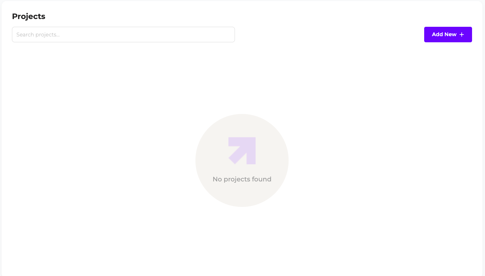

## 4. Blur effect on modal

The blur effect was implemented manually. The blur effect is shown when the user tries to create a new item.

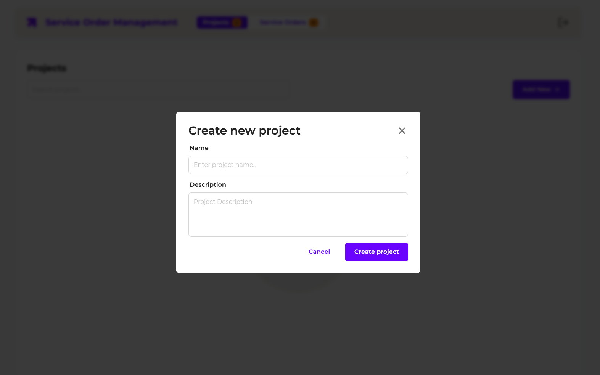

## 5. Quantity of items

The quantity of items is shown in the list header.

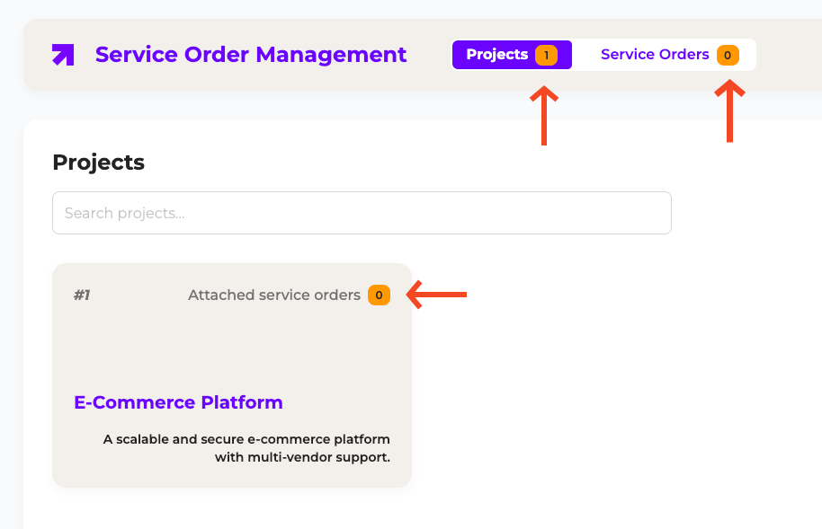

## 6. Loading indicator

The global App loading indicator is shown when the user tries to login.

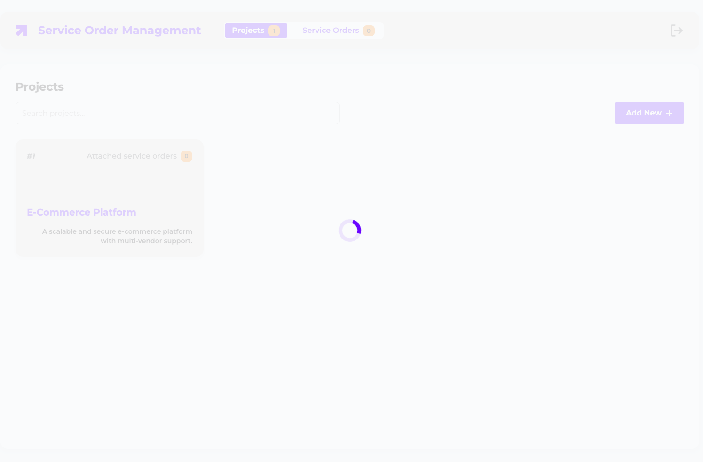

## 7. Search items

The search items feature is implemented in the list. The user can search items by name/description/project/category.

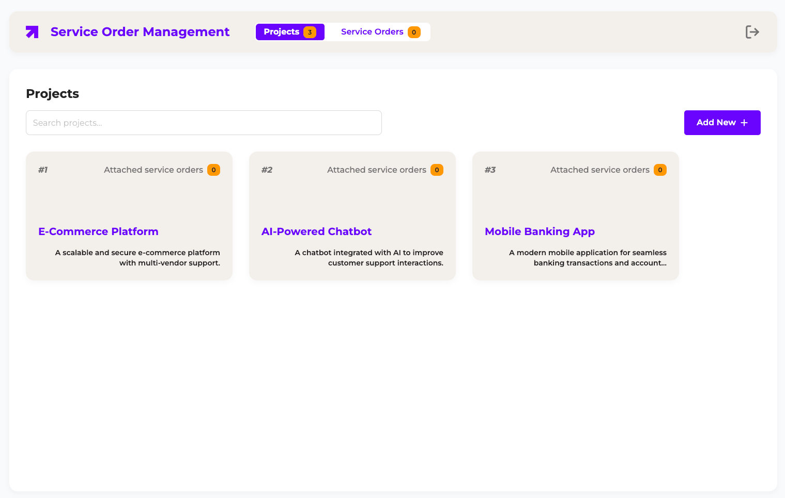
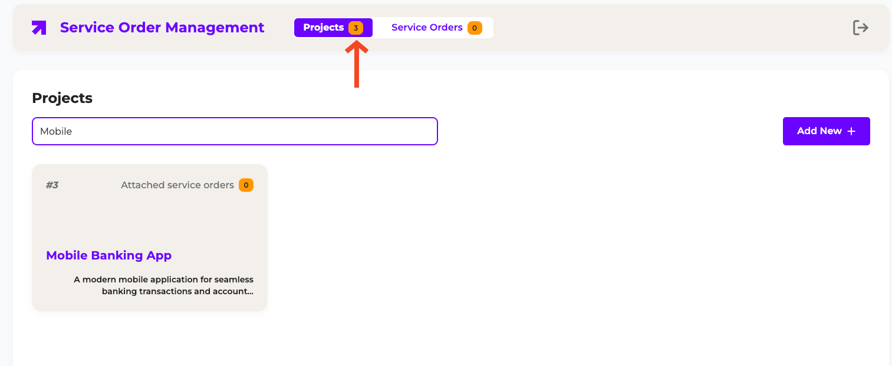

## 8. Project details

The project details feature is implemented to see the project details, attached items and handle basic CRUD operations.

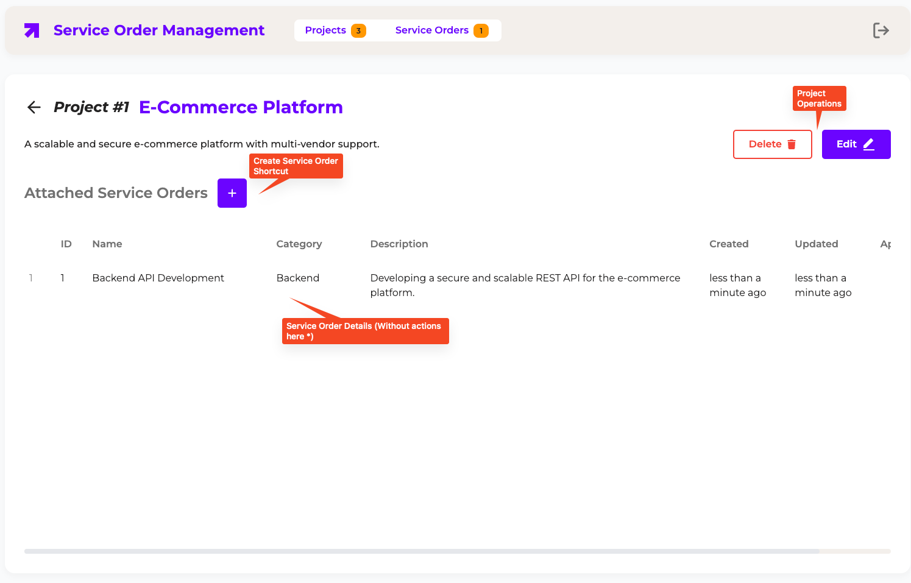

## 9. Service order details

The service order details feature is implemented to see the service order details, attached items and handle basic CRUD operations.

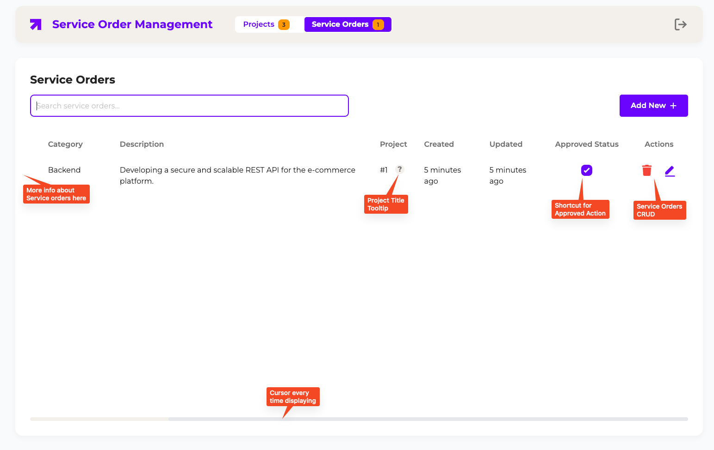
